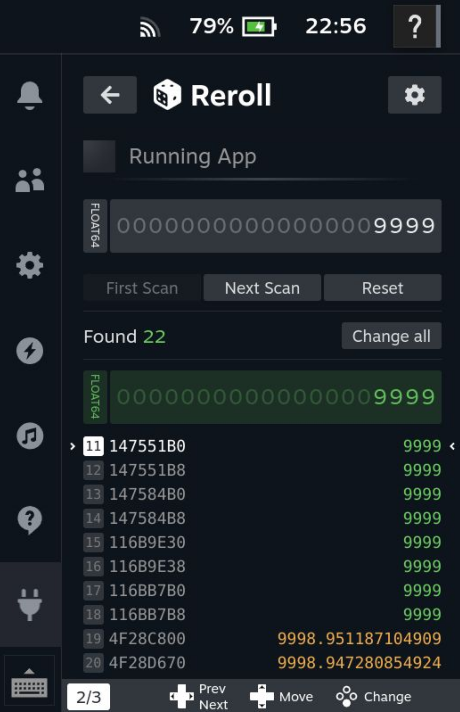
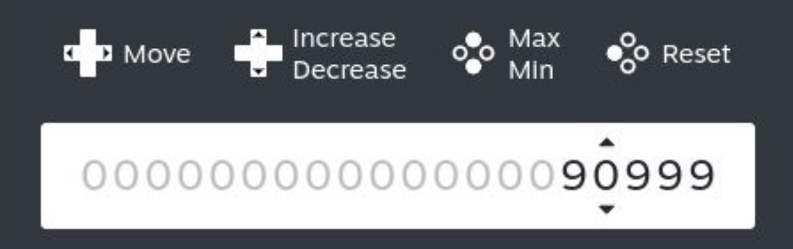

# Reroll

A high-performance memory scanning plugin for the Steam Deck, inspired by [Memory Deck](https://github.com/CameronRedmore/memory-deck).

## Why Reroll?
I have been a long-time user of [Memory Deck](https://github.com/CameronRedmore/memory-deck)—it is a fantastic tool that has saved me countless hours.

However, as my needs grew, I found the scanning speed and UI flow could be further optimized. **Reroll** was created to bridge that gap, focusing on performance and a streamlined user experience.

## Key Features
- 🚀 **Ultra-Fast Scanning**: Millisecond-level scanning that delivers results before you can even blink, powered by [memscan](https://github.com/kayon/memscan), a high-performance engine custom-built for the Steam Deck.
- 🎯 **Smart Process Identification**: Automatically detects the currently active game—eliminating the need to scroll through messy process lists or risk selecting the wrong target.
- 📱 **Compact Interface**: A streamlined, single-pane UI optimized for handheld play; focused on speed and efficiency without the need for scrolling.

## Installation
### Method 1: From Decky Store (Recommended)
1. Ensure you have [Decky Loader](https://github.com/SteamDeckHomebrew/decky-loader) installed.
2. Search for **Reroll** in the Decky Store and click Install.

### Method 2: Install via URL (For Beta/Latest Updates)
If you wish to install a specific version or a pre-release directly:
1. Open **Settings** in the Decky Loader menu.
2. Go to the **Developer** tab.
3. Find the **Install from URL** field.
4. Paste the following URL:

   `https://github.com/kayon/decky-reroll/releases/latest/download/Reroll.zip`
5. Click **Install**.

## Future Plans
- [ ] Temporary save slots for search results
- [ ] Value freezing (Locking)
- [ ] Support for negative value searching

## Maintenance & Contribution
As an individual developer, my time and energy are limited, so updates may not always be immediate. However, I am the primary user of this plugin myself. As long as I'm using it, the project will remain active as I fix bugs and implement new ideas within my capabilities.

**Note on Scope:** This is designed to be a lightweight and simple tool. Advanced features like String searching are currently not planned, as they are rarely used in handheld scenarios, and I prefer to keep the project focused and uncomplicated.

If you find this plugin helpful and want to support its development, please consider giving this project a **Star** ⭐!

## Disclaimer
**Use at your own risk.** Modifying process memory is an inherently intrusive operation that may lead to game instability, data corruption, crashes, or online bans. The developers of this project are not responsible for any damage, loss of data, or account-related issues resulting from the use of this software.

## License
This project is licensed under the **GNU General Public License v3.0**.

**Note on Backend:** This plugin utilizes [memscan](https://github.com/kayon/memscan) as its core scanning engine. Both the frontend and backend components are open-sourced under the GPL v3 license to ensure the technology remains free and transparent for the Steam Deck community. For more details, please refer to the [LICENSE](LICENSE) file.