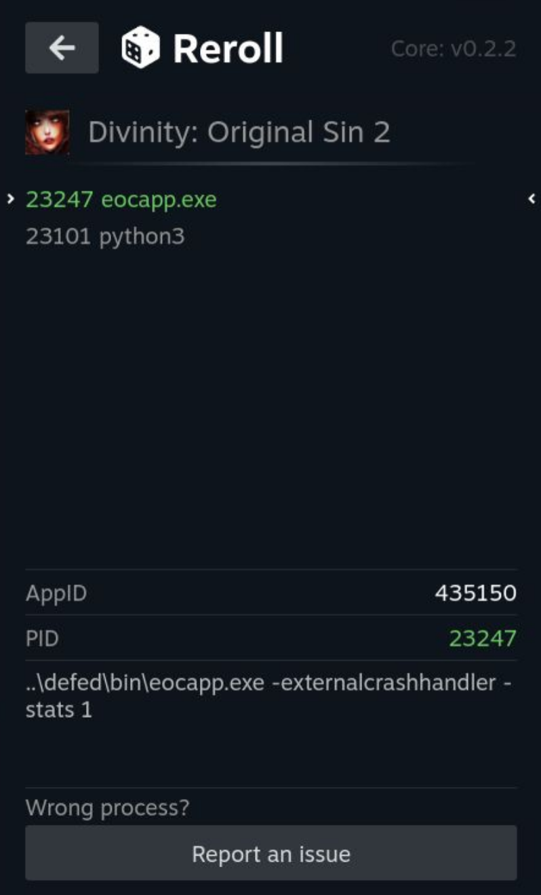

# Reroll

A high-performance memory scanning plugin for the Steam Deck, inspired by [Memory Deck](https://github.com/CameronRedmore/memory-deck).


## Why Reroll?
I have been a long-time user of [Memory Deck](https://github.com/CameronRedmore/memory-deck)—it is a fantastic tool that has saved me countless hours.

However, as my needs grew, I found the scanning speed and UI flow could be further optimized. **Reroll** was created to bridge that gap, focusing on performance and a streamlined user experience.

## Key Features
- 🚀 **Ultra-Fast Scanning**: Millisecond-level scanning that delivers results before you can even blink, powered by [memscan](https://github.com/kayon/memscan), a high-performance engine custom-built for the Steam Deck.
- 🎯 **Smart Process Identification**: Automatically detects the currently active game—eliminating the need to scroll through messy process lists or risk selecting the wrong target.
- 📱 **Compact Interface**: A streamlined, single-pane UI optimized for handheld play; focused on speed and efficiency without the need for scrolling.

## What's New
### v0.2.0 (backend core: v0.3.0)
This update introduces a major overhaul of the scanning engine, delivering significant performance gains and new features:
* **NextScan Optimization**: Refactored the scanning algorithm. For datasets exceeding 10 million results, `NextScan` latency has been reduced from seconds to milliseconds.
* **Ordered Results**: Search results are now displayed in ascending order.
* **Undo Support**: Added Undo Scan functionality to revert the previous scan operation.

## Installation
### Method 1: From Decky Store (Recommended)
1. Ensure you have [Decky Loader](https://github.com/SteamDeckHomebrew/decky-loader) installed.
2. Search for **Reroll** in the Decky Store and click Install.

### Method 2: Install via URL (For Beta/Latest Updates)
If you wish to install a specific version or a pre-release directly:
1. Open **Settings** in the Decky Loader menu.
2. Enable **Developer Mode**.
3. Go to the **Developer** tab.
4. **Choose an installation method:**
   * **Install via URL:** Paste the following URL into the **Install from URL** field and click **Install**:
     ```text
     https://github.com/kayon/decky-reroll/releases/latest/download/Reroll.zip
     ```
   * **Install from Local Zip:** Download the `Reroll.zip` file from the [Releases](https://github.com/kayon/decky-reroll/releases) page to your Steam Deck. Then, click **Install Plugin from Zip** and select the downloaded file.


## Why does this plugin require root privileges?
`Proton` games usually do not require `root` privileges to access memory because `Proton` runs as the `deck` user.

However, for native Linux games, `root` is mandatory.

## 💡 No results? Try selecting the process manually

**A quick tip on the Auto-Select logic:**

If you find that your searches aren't returning any results, it’s likely because you opened Reroll and clicked the "Game Name" before the game was fully launched.

In this case, the actual game process might not have been created yet. Reroll’s auto-select logic might "grab" the wrong thing (like a launcher or a splash screen script) instead. While most people don't click that fast, I found this edge case during testing.

**The fix is easy:**
I’ve kept the **Manual Selection** feature just for this reason. If you think the wrong process was picked:
1. Click the "Game Name" again to open the process list panel.
2. Manually select the **first item** in the list (usually, the first one is the real game).
3. For the best experience, wait until you reach the game's **Main Menu** before you start searching!



## Future Plans
- [x] Undo scan
- [ ] Support for negative value searching
- [ ] Temporary save slots for search results
- [ ] Value freezing (Locking)

## Maintenance & Contribution
As an individual developer, my time and energy are limited, so updates may not always be immediate. However, I am the primary user of this plugin myself. As long as I'm using it, the project will remain active as I fix bugs and implement new ideas within my capabilities.


**Note on Scope:** This is designed to be a lightweight and simple tool. Advanced features like String searching are currently not planned, as they are rarely used in handheld scenarios, and I prefer to keep the project focused and uncomplicated.


If you find this plugin helpful and want to support its development, please consider giving this project a **Star** ⭐!


## Disclaimer
**Use at your own risk.** Modifying process memory is an inherently intrusive operation that may lead to game instability, data corruption, crashes, or online bans. The developers of this project are not responsible for any damage, loss of data, or account-related issues resulting from the use of this software.

## License
This project is licensed under the **GNU General Public License v3.0**.

- **Core Engine:** This plugin utilizes [memscan](https://github.com/kayon/memscan) as its core scanning engine. Both the frontend and backend components are open-sourced under the GPL v3 license.
- **Template & Scaffolding:** This project is derived from the [decky-plugin-template](https://github.com/SteamDeckHomebrew/decky-plugin-template), which is licensed under the **BSD 3-Clause License**.

For full licensing details, including the mandatory BSD 3-Clause notices, please refer to the [LICENSE](LICENSE) file.